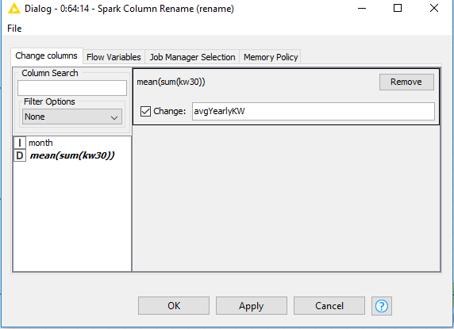

## Big Data Genap 2019/2020

**Nama**  : Ramadhan Ilham Irfany<br>
**NRP**   : 05111740000121<br><br><br>

# Analisis Produksi Beer Bulanan di Australia

## Business Understanding
Proses yang dilakukan pada dataset yang digunakan adalah :
- Menganalisis rata-rata produksi beer di Australia pada kurun waktu tertentu (time series), dengan mempertimbangkan:
   - **Total Usage**: Keseluruhan Produksi Beer dalam satuan waktu Bulan (Dikarenakan semua data unik dan data disajikan dalam format bulanan).
   - **Usage by Year**: Produksi Beer per Tahun dalam satuan waktu Bulan.
 
## Data Understanding
Data yang digunakan pada proses kali ini adalah Data Produksi Beer Bulanan di Australia dengan atribut yang digunakan meliputi:
- **Month**: Bulan produksi.
- **Monthly beer production**: Rata-rata produksi beer bulanan.

## Data Preparation
Untuk menjalankan workflow ini dapat di ambil dalam repository pada folder ini dan menggunakan dataset yang juga sudah terlampir<br>


- Pertama-tama membuat spark context local menggunakan node **Create Local Big Data Environment**
- Lalu membaca dataset Penggunaan Listrik di Irlandia dengan **File Reader**

- Berikut konfigurasi node **Create Local Big Data Environment**<br>


- Dan berikut untuk konfigurasi node **File Reader**<br>


pastikan membuka file dataset (.csv) yang terlampir

- Setelah itu menambahkan metanode **Load Data** yang berisikan node-node sebagai berikut<br>


- Pada node **DB Table Creator**, masukkan konfigurasi seperti berikut, dimana menamai tabel sebagai "beer"<br>


- Untuk konfigurasi node **DB Loader** adalah seperti berikut<br>


- Setelah itu data sudah masuk pada DB dan siap untuk diproses lebih jauh, cek pada Apache Hive apakah sudah masuk<br>


- Setelah Data berhasil di load, kemundian ubah menjadi data Spark untuk pemodelan dengan node **Hive to Spark**<br>


## Modelling


- Pada model ini terdapat 2 metanode yaitu:
	1. **Extract date-time attributes**: untuk mendapatkan waktu agar dapat di proses untuk selanjutnya
	2. **Agreagations and time series**: agregasi untuk mencari rata-rata Produksi Beer per Tahun dalam satuan waktu Bulan
	
 ### 1. Extract date-time attributes
- Untuk metanode Extract date-time attributes bersikan oleh 2 node **Spark SQL Query** sebagai berikut<br>


- Untuk node **Spark SQL Query** pertama yaitu untuk mengkonversikan datetime dari string Month<br>


- Berikut SQL Query yang ada pada node tersebut
```
SELECT 

`Month`,
`Monthly beer production` as kw30,
date_add(to_date(from_unixtime(UNIX_TIMESTAMP(`Month`, 'yyyy-MM'))), cast(16 as int)) as eventDate

FROM #table# t1
```
Sumber referensi: [String to Date conversion in hive](https://bigdataprogrammers.com/string-date-conversion-hive/). Saya menambahkan int 16 untuk mengeset tanggal karena Hive support untuk format yyyy-MM-dd
- Berikut hasil dari query tersebut<br>


- Untuk node **Spark SQL Query** kedua yaitu untuk mengekstrak/mengambil tahun dan bulan pada datetime yang sudah dibuat<br>


- Berikut SQL Query yang ada pada node tersebut
```
SELECT 

`kw30`,
`eventDate`,
year(eventDate) as year,
month(eventDate) as month

FROM #table# t1
```
- Berikut hasil dari query tersebut<br>


### 2. Agreagations and time series


- Metanode ini adalah untuk membuat time-series berdasarkan 2 kategori pada **Business Understanding** yaitu:
   - **Total Usage**: Keseluruhan Produksi Beer dalam satuan waktu Bulan (Dikarenakan semua data unik dan data disajikan dalam format bulanan).
   - **Usage by Year**: Produksi Beer per Tahun dalam satuan waktu Bulan.
   
- Gambaran prosesnya adalah:
	- Pengambilan jumlah produksi beer dengan menggunakan agregasi SUM untuk tiap kategori dengan memakai **month** sebagai parameter GroupBy
	- Pada kategori **Usage by Year** diambil rata-rata produksi beer tiap tahun dalam satuan waktu bulan menggunakan agregasi AVG
	- Semua hasil agregasi diganti nama agar mudah untuk dibaca dan digabungkan menggunakan Joiner 
   
- Sebelum memproses data tambahkan node **Persist Spark DataFream/RDD** dengan konfigurasi sebagai berikut<br>


- Berikut ini adalah dokumentasi untuk tiap-tiap kategori:
#### Total Usage
- Konfigurasi node **Spark GroupBy** untuk pengambilan jumlah produksi beer dengan menggunakan agregasi SUM degan parameter **month** pada kategori **Total Usage**<br>


- Berikut adalah hasil dari agregasi tersebut<br>


- Konfigurasi node **Spark Column Rename** untuk penggantian nama kolom menjadi **totalKW** agar mudah untuk dibaca<br>


- Hasil dari pengubahan nama<br>


#### Usage by Year
- Konfigurasi node **Spark GroupBy** untuk pengambilan jumlah produksi beer dengan menggunakan agregasi SUM degan parameter **month** dan **year** pada kategori **Usage by Year**<br>


- Berikut adalah hasil dari agregasi tersebut<br>


- Konfigurasi node **Spark GroupBy** untuk pengambilan rata-rata produksi beer tiap tahun dalam satuan waktu bulan menggunakan agregasi AVG<br>


- Berikut adalah hasil dari agregasi tersebut<br>


- Konfigurasi node **Spark Column Rename** untuk penggantian nama kolom menjadi **avgYearlyKW** agar mudah untuk dibaca<br>


- Hasil dari pengubahan nama<br>


- Setelah selesai memproses 2 kategori, buatlah node **Spark Joiner** untuk menggabungkan kategori tersebut untuk proses selanjutnya<br>


- Dan inilah data yang akan digunakan untuk tahap evaluasi<br>


## Evaluation


- Pada tahap Evaluasi menggunakan komponen-komponen seperti **PCA, K-means, Scatter Plot** untuk menganalisis menggunakan PCA dan K-means kemudian di plot pada tabel menggunakan Scatter Plot
- Berikut isi dari komponen **PCA, K-means, Scatter Plot**<br>


- Pertama-tama melakukan normalisasi menggunakan node **Spark Normalizer**<br>


- Kemundian melakukan PCA (**Principal Component Analysis**). Dikarenakan dataset berukukan kecil maka saya menggunakan 100% dari dataset<br>


- Beginilah hasil dari PCA yang telah dilakukan<br>


- Lalu untuk pengelompokan cluster mengunakan algoritma K-means dengan node **Spark k-Means**<br>


- Dan beginilah hasil dari pengelompokan K-means<br>


- Tambahkan column filter untuk menampilkan month dan cluster<br>


- Beginilah hasilnya setelah di filter<br>


- Setelah itu tambahkan joiner seperti dengan parameter "month"<br>


- Dan beginilah hasil setelah menggabungkan **PCA** dan **K-Means**<br>


- Kemudian tambahkan node **Spark to Table** untuk mengubah data spark menjadi table
- Setelah itu lakukan denormalisasi untuk membuat table view
- Lalu tambahkan node **Number to String** untuk keperluan kustomisasi tabel dengan konfigurasi sebagai berikut<br>


- Beginilah hasil input untuk kustomisasi tabel<br>


- Lalu atur warna pada cluster menggunakan node **Color Manager**<br>


- Beginilah hasil dari pewarnaan cluster dalam bentuk tabel<br>


- Kemudian lakukan plotting menggunakan node **Scatter Plot**<br>


- Beginilah hasil dari plotting menggunakan **Scatter Plot**<br>


- Setelah itu membuat node **Table View** untuk membuat tabel Aggregated Beer Data<br>


- Dan beginilah tampilan JavaScript untuk tabel<br>


- Kemudian pada denormalisasi ubahlah menjadi spark kembali menggunakan **Table to Spark**
- Menghilangkan underscore pada PCA dimension untuk deployment menggunakan node **Spark Column Rename**<br>


## Deployment


- Pada proses deployment di workflow ini terdapat 2 deployment yaitu menggunakan node **Spark to Hive** dan **Spark to Parquet**
- Berikut konfigurasi pada node **Spark to Hive**<br>


dikarenakan saya mengerjakan 4 dataset simultan maka saya akan mengatur **Remove table** jika table sudah ada sebelumnya
- Dan berikut hasil dari deployment<br>


- Berikut konfigurasi pada node **Spark to Parquet**<br>


untuk parquet-nya sama seperti hive dikarenakan saya mengerjakan simultan maka saya rename **Target name** sesuai dataset
- Dan berikut hasil deploymentnya<br>

