## Big Data Genap 2019/2020

**Nama**  : Ramadhan Ilham Irfany 
**NRP**   : 05111740000121   

# Business Understanding
Kemungkinan proses bisnis yang dapat dilakukan pada dataset ini antara lain :
 1. Mensegmentasi pelanggan dari mall yang bersangkutan
 
 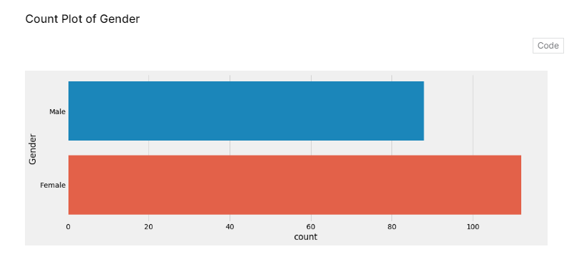
 
 2. Analisis pelanggan dari mall yang bersangkutan
 
 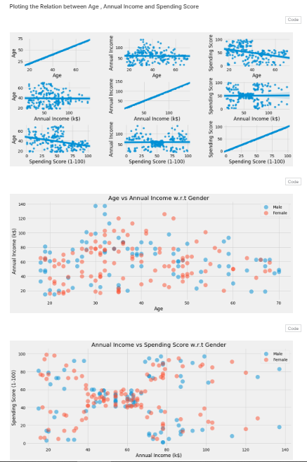
 
 3. Membuat cluster perilaku pelanggan pada mall yang bersangkutan berdasarkan Spending Score dan Annual Income
 
 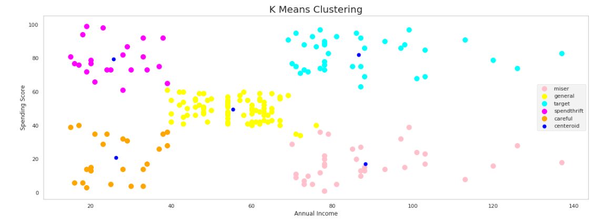
# Data Understanding
- Dataset disini memuat data pelanggan dari sebuah mall yang berisikan Jenis Kelamin, Usia, Gaji per Tahun, serta Spending Score yang diberikan oleh mall yang bersangkutan berdasarkan perilaku dan jumlah belanjaan dari pelanggan. Format file dari dataset adalah Comma Separated Values (.csv).
- Data yang dimuat berjumlah 200 pelanggan dengan 5 atribut/kolom sebagai berikut:
    - CustomerID : ID yang dimiliki pelanggan.
    - Gender : Jenis kelamin pelanggan.
    - Age : Usia pelanggan.
    - Annual Income : Gaji dalam satuan ribu dollar per tahun dari pelanggan.
    - Spending Score (1-100) : Skor yang diberikan mall untuk pelanggan berdasarkan perilaku dan jumlah belanjaan.
# Data Preparation

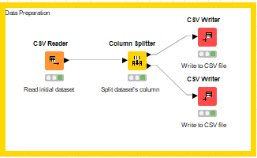
- Pertama, dataset yang tersedia di-read menggunakan CSV Reader.
- Selanjutnya dihubungkan ke column splitter dan atur untuk column apa yang dipisah.

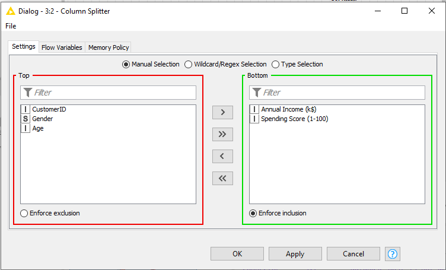
- Setelah mengeksekusi CSV Writer akan muncul file CSV yang merupakan hasil dari split yang telah dilakukan.

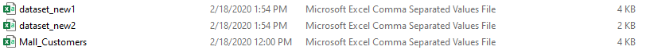
- Simpan salah satu file yang telah di split ke dalam database menggunakan DB Table Selector dan isi nama table yang akan dibuat, yaitu table customers.

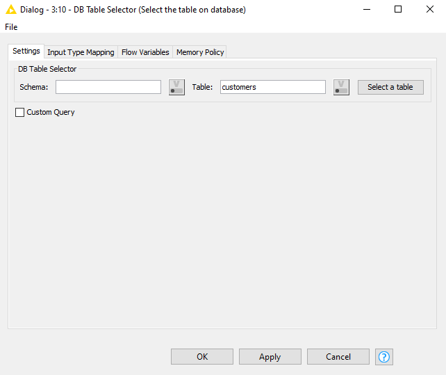
- note: untuk seluruh node setelah ini yang berhubungan dengan database harus terhubung ke MySQL Connector yang sudah terlogin pada phpmyadmin
- Hasil data pada table customers:

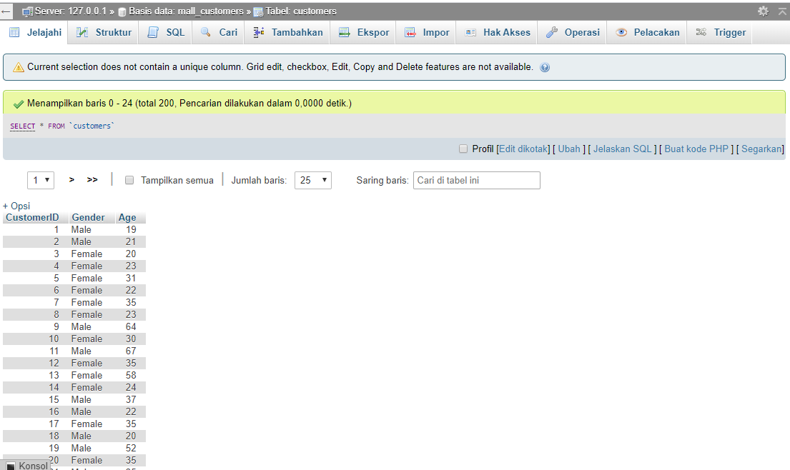
# Modelling

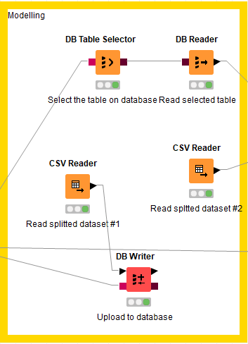
### Membaca dataset dari CSV file
- Menggunakan CSV Reader pada KNIME dan buka data yang telah di-split selain yang disimpan pada database.

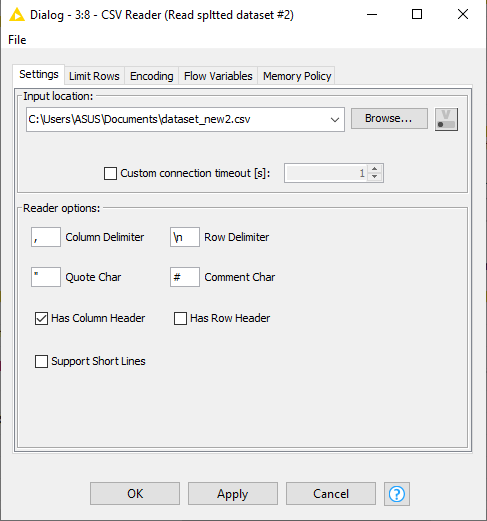
### Membaca dataset dari Database
- Hubungkan data yang telah disimpan pada database ke DB Reader.

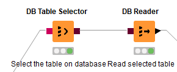
### Append kedua dataset
- Dengan menghubungkan CSV Reader dan DB Reader ke Column Appender dan kedua dataset siap di append dengan Execute Column Appender.

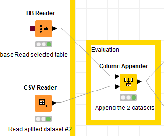
# Evaluation
- Untuk evaluasi sebenarnya sudah bisa dilihat dari lamu hijau yang menyala pada node Column Appender namun untuk membuktikan data yang di-append adalah sama dengan initial dataset maka saya menggunakan [online checker](https://extendsclass.com/csv-diff.html) untuk mengetesnya, dan berikut [hasilnya](https://github.com/rmdhnilham/big-data/blob/master/Tugas1/Evaluation_Check.csv)
# Deployment
- Dari hasil Column Append, gunakan node CSV Writer dan DB Writer untuk men-deploy ke CSV ataupun Batabase

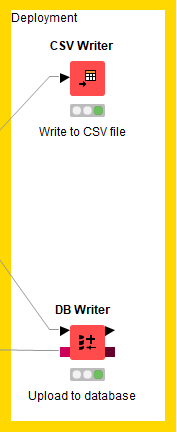
### Hasil Deploy CSV

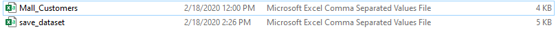
### Hasil Deploy Database

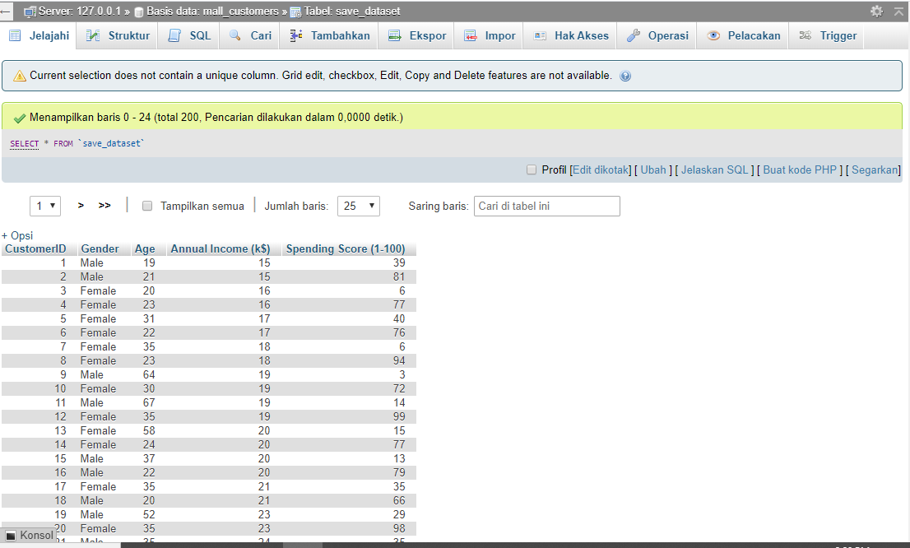
