# Connect

- Membuka SQLite pada dbeaver 

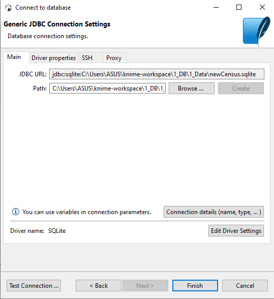

- Mengubah nama semua tabel dengan prefix "05111740000121"

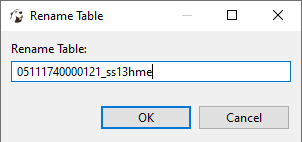

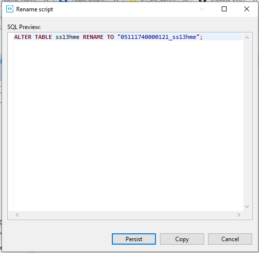

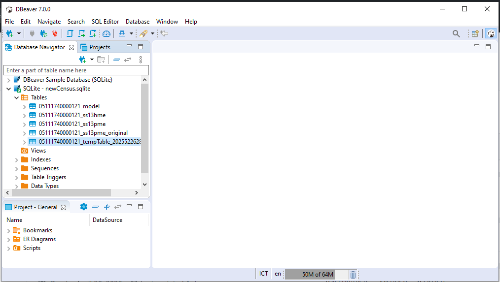

Semua tabel sudah terganti nama

- Execute SQLite Connector

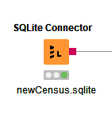

- Buka node DB Table Selector dan pilih tabel yang diinginkan

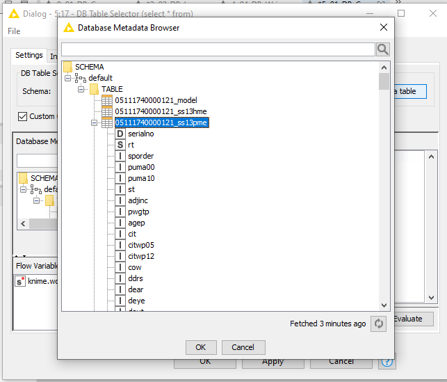

- Kemudian execute node tersebut

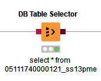

- Selanjutnya execute node DB Reader dan buka KNIME data table

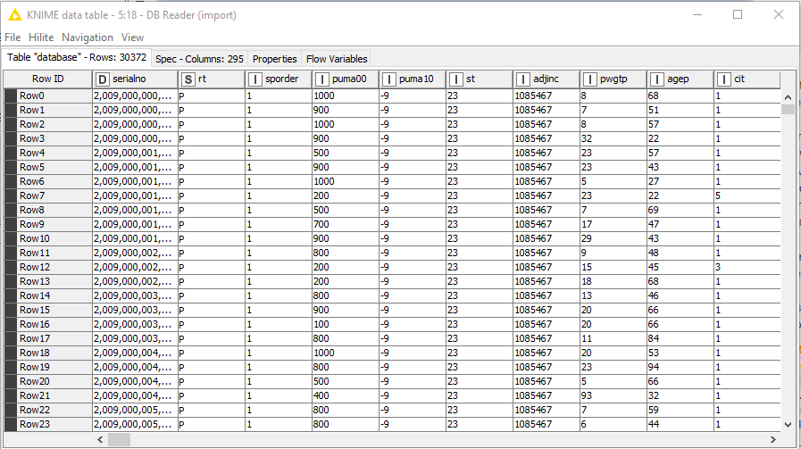

# InDB Processing

- Connect SQLite seperti diatas

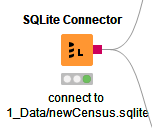

- Select table yang akan diproses

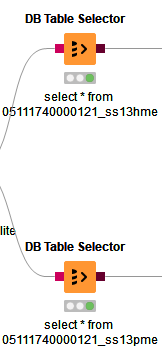

- Tambahkan Column Filter dan remove puma* dan pwgtp* pada tabel

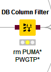

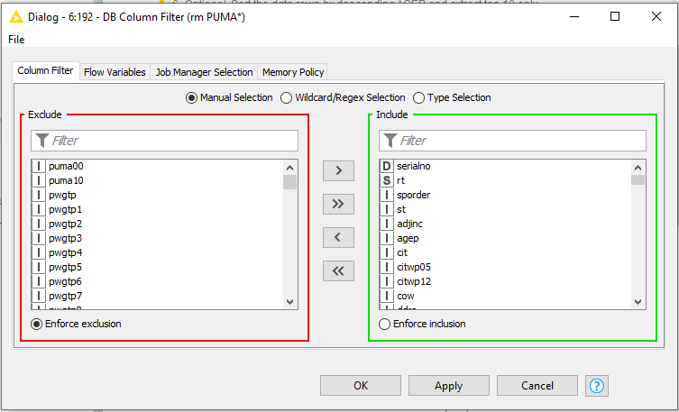

- Join kan tabel ss13hme dan ss13pme dengan menambahkan DB Joiner dengan acuan Serial No

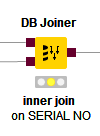

- Setting seperti berikut

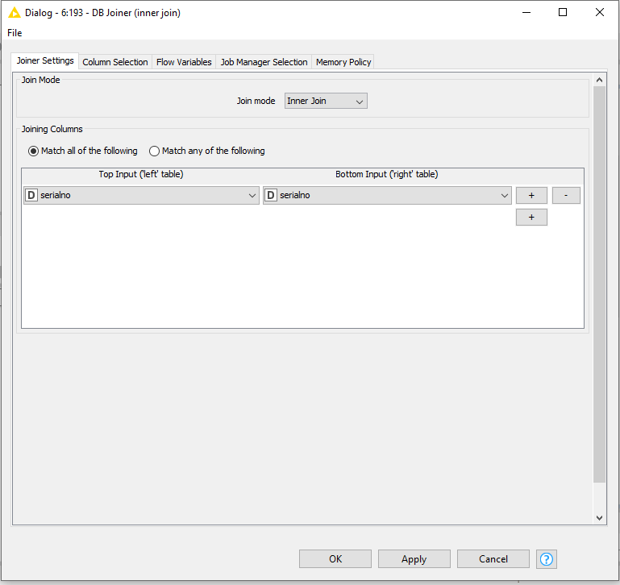

- Maka hasilnya akan seperti ini

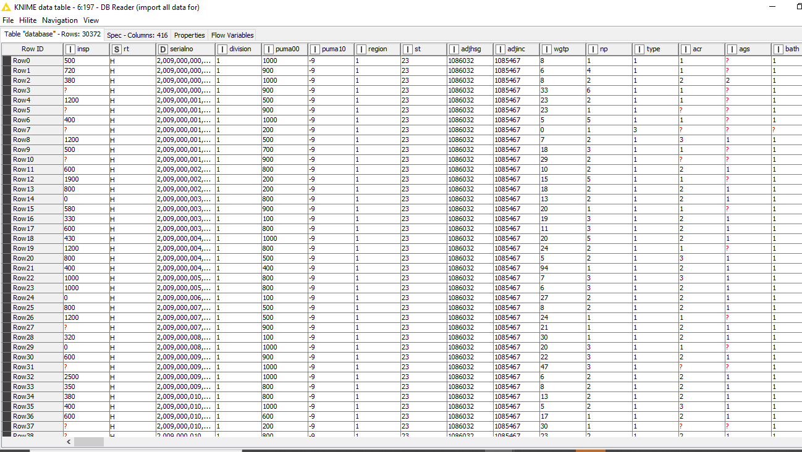

- Menambahkan Row Filter

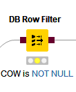

- Filter pada tabel cow yang tidak NULL

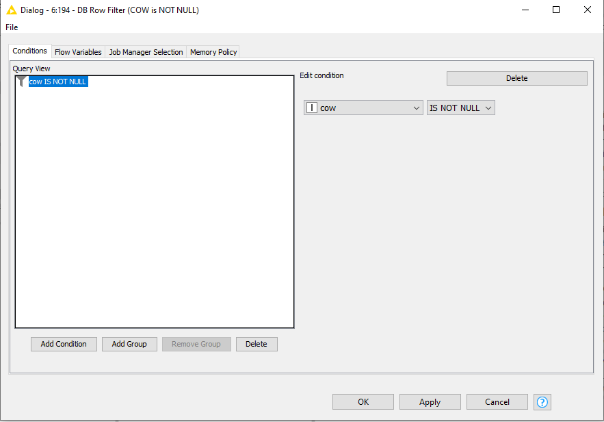

- Maka hasilnya akan seperti ini

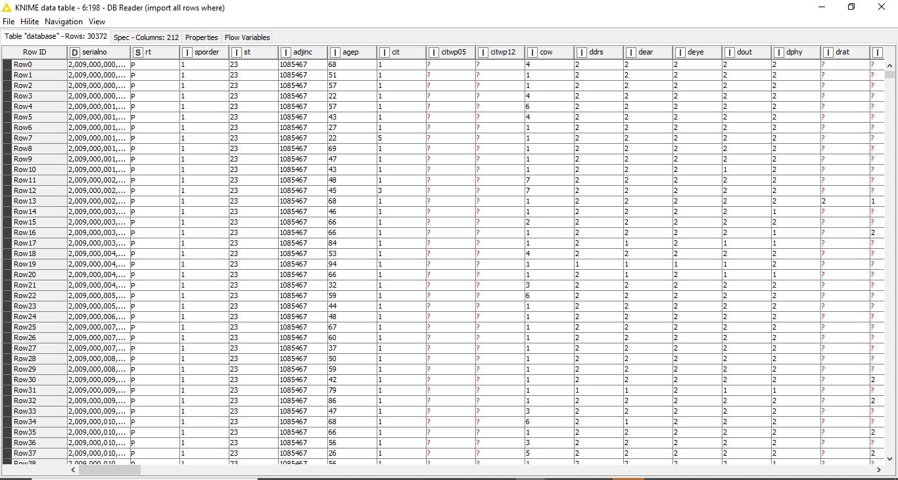

- Tambahkan Row Filter lagi

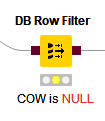

- Kali ini filter pada tabel cow yang NULL

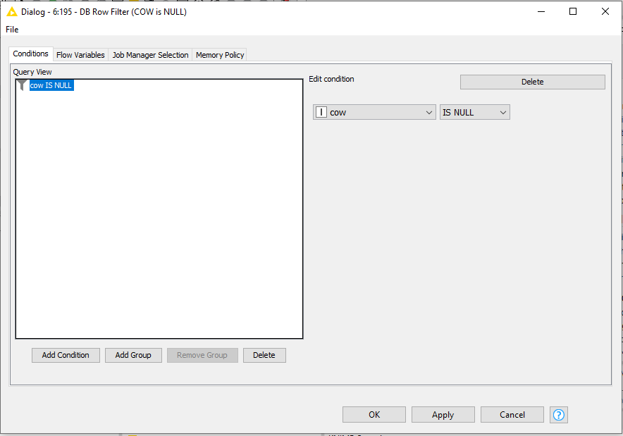

- Maka hasilnya akan seperti ini

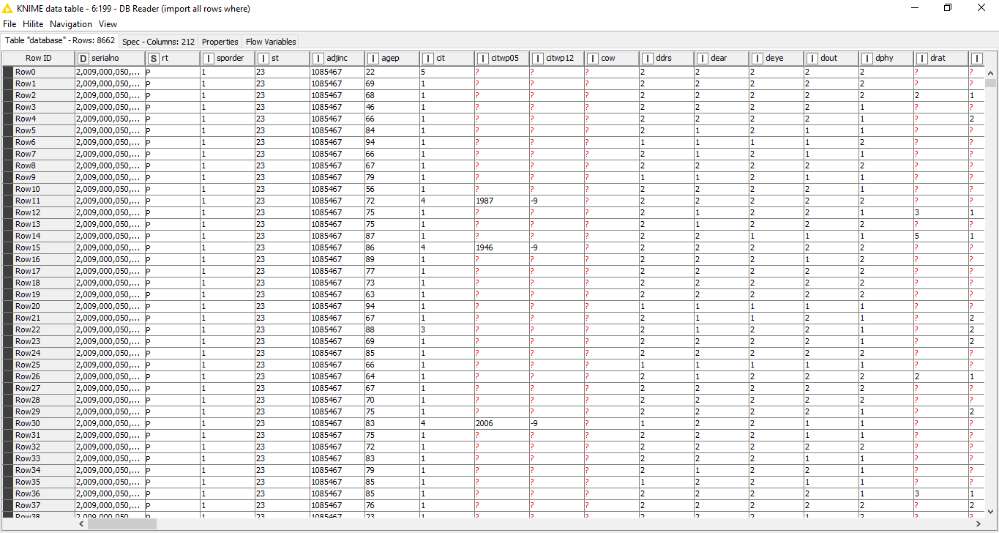

- Tambahkan node DB GroupBy

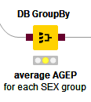

- Setting rata-rata umur dan group by jenis kelamin

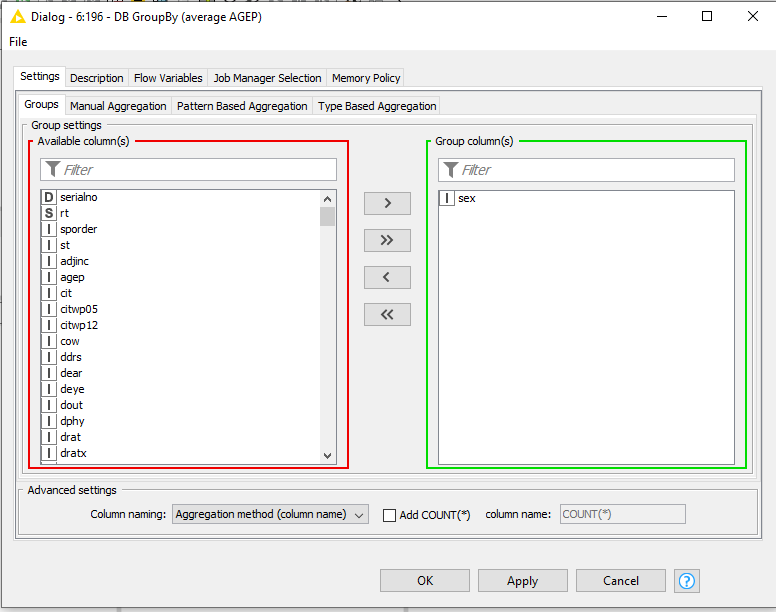

- Maka hasilnya akan seperti ini

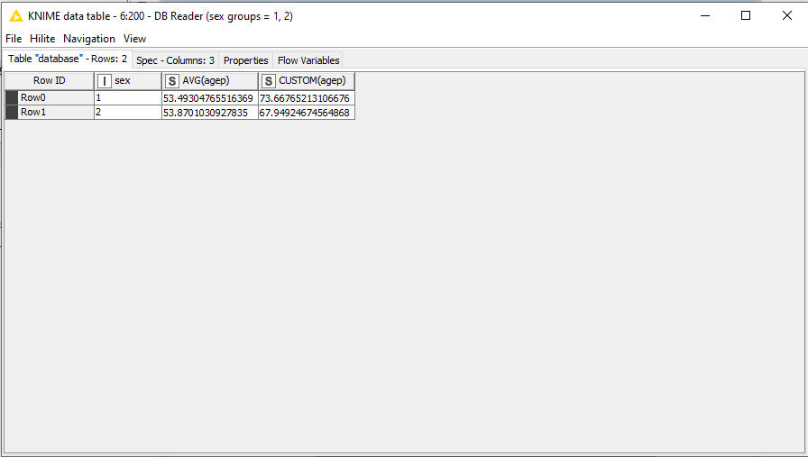

- Terakhir, sorting umur secara descending dan ambil top 10

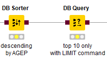

- Lakukan setting seperti ini pada sorting

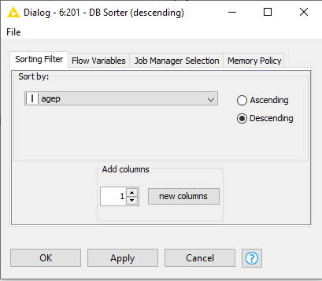

- Lakukan setting seperti ini pada query mengambil 10 teratas

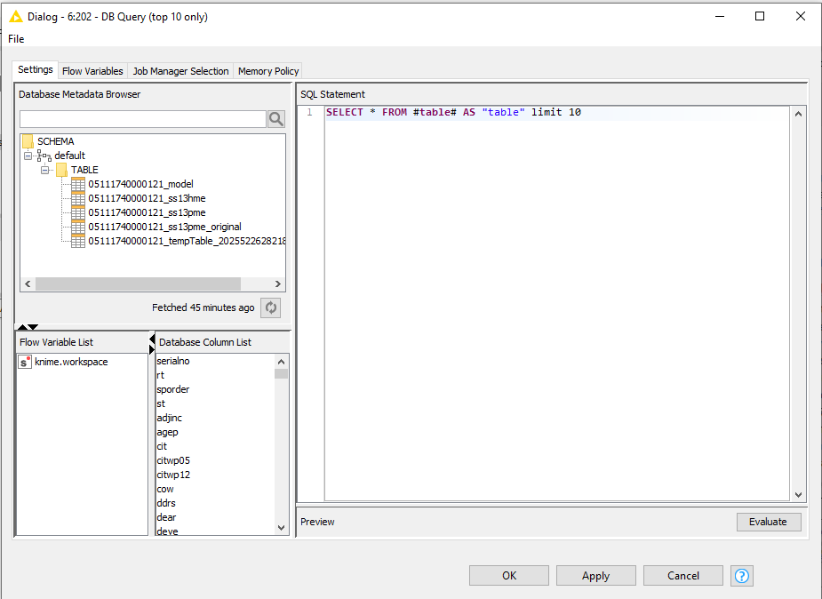

- Maka hasilnya akan seperti ini

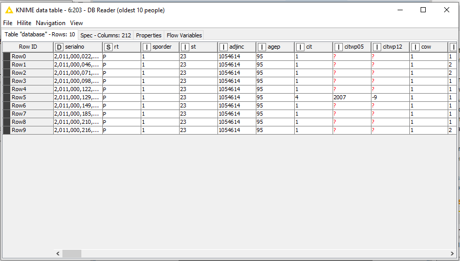

# Modelling

# WritingToDB
