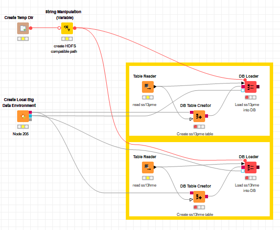

# Setup Table

- Pertama-tama lakukan preparation seperti pada DB-Exercise dengan menamai tabel dengan prefix NRP

- Berikut Workflow untuk Setup Hive Table

- Setting pada DB Table Creator

- Kemudian cek port hive connection pada KNIME dan buat Apache Hive pada DBeaver dengan port yang sama

- Setelah itu cek pada Apache Hive di DBeaver apakah tabel sudah masuk

# Modelling

- Model sama dengan DB-Exercise namun disamakan Hive Connection dan port Apache Hive pada DBeaver

- Berikut workflownya

- Pastikan dapat terjalankan semua

- Berikut tree yang dihasilkan

# WritingToDB

- 
