## Big Data Genap 2019/2020

**Nama**  : Ramadhan Ilham Irfany 
**NRP**   : 05111740000121   

# Business Understanding
Kemungkinan proses yang dapat dilakukan pada dataset yang digunakan antara lain :
 1. Pengelompokan film berdasarkan genre yang diinginkan
 
 2. Pengelompokan film berdasarkan rating yang diberikan oleh user dari tahun 1995 sampai 2015
 
 3. Merekomendasikan film dalam jumlah tertentu berdasarkan rating yang diberikan oleh user dari tahun 1995 sampai 2015
 
 
# Data Understanding
- Dataset yang digunakan bersumber dari [MovieLens](http://movielens.org). 

- Dataset yang disajikan memuat rating berbasis 5-bintang berjumlah 20000263 rating, dan 465564 tag dari keseluruhan 27278 film. Data menampung rating dari 138493 user sejak tanggal 9 Januari 1995 sampai 31 Maret 2015. Dataset ini sendiri dibuat pada 17 Oktober 2016.

- Data yang dimuat dalam [MovieLens 20M Dataset](https://grouplens.org/datasets/movielens/) ini terdapat beberaba file CSV, dimana setiap CSV memiliki data atribut dengan rincian sebagai berikut:
    - genome-scores.csv = berisikan data relevansi antara suatu film dan tag nya untuk kepentingan rekomendasi
       - movieId
       - tagId
       - relevance
    - genome-tags.csv = berisikan data pengidentifikasian tag yang diberikan oleh user untuk kepentingan rekomendasi
       - tagId
       - tag
    - links.csv = berisikan data tentang sumber rating (imdb dan tmdb)
       - movieId
       - imdbId
       - tmdbId
    - movies.csv = berisikan daftar film yang tersedia
       - movieId
       - title
       - genres
    - ratings.csv = berisikan data rating yang diberikan oleh user
       - userId
       - movieId
       - rating
       - timestamp
    - tags.csv = berisikan tag yang diberikan oleh user
       - userId
       - movieId
       - tag
       - timestamp

# Data Preparation

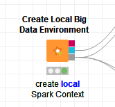
- Pertama-tama membuat spark context local menggunakan Create Local Big Data Environment

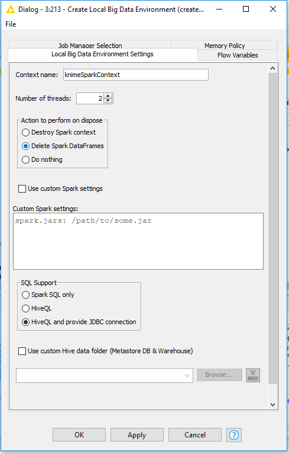
- Setting pada Create Local Big Data Environment

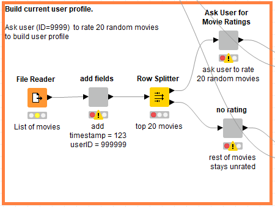
- Lalu membuat profil user dengan ID 9999 untuk memberi rating pada 20 film acak

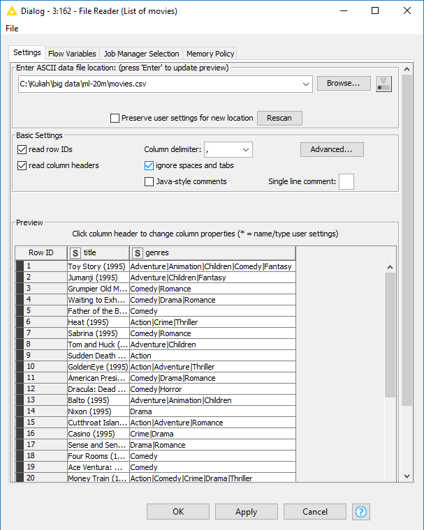
- Konfigurasi pada node File Reader untuk membaca file movies.csv

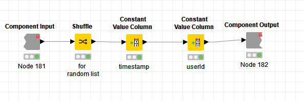
- Di dalam node add fields terdapat beberapa komponen
- Node add fields sendiri merupakan penambahan kolom untuk user ID 9999

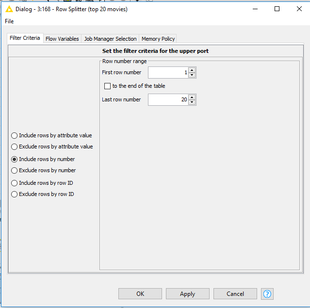
- Konfigurasi pada node Row Splitter untuk mengambil 20 film

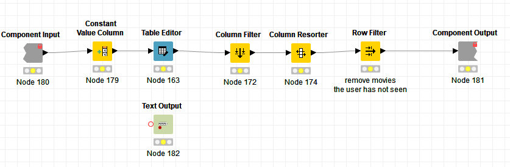
- Di dalam node Ask User for Movie Ratings terdapat beberapa komponen
- Node Ask User for Movie Ratings ini meminta user ID 9999 untuk merating 20 movie yang terpilih

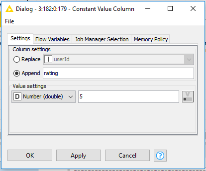
- Konfigurasi untuk memberi rating di dalam komponen Constant Value Column
- Disini saya memberi rating 5 yang menandakan 20 film tersebut sangat disukai oleh user ID 9999 dan akan mencari rekomendasi dari film tersebut

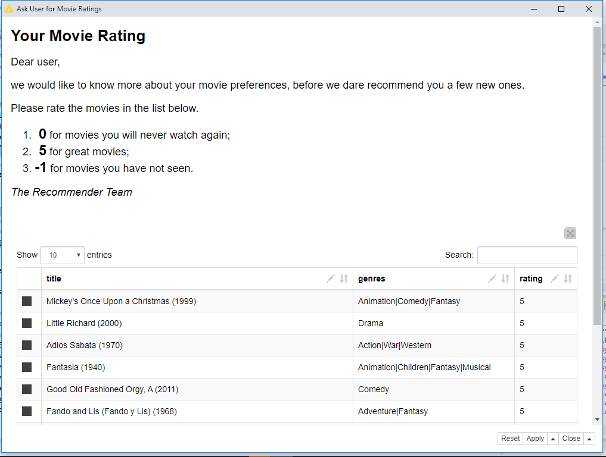
- Film sudah diberikan rating

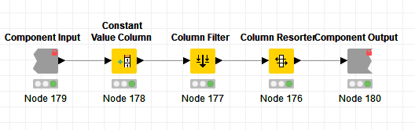
- Di dalam node no rating terdapat beberapa komponen
- Node no rating sendiri berfungsi untuk membuat list film dengan rating 0

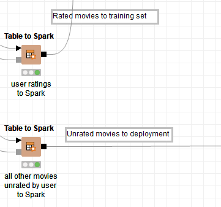
- Kemudian tambahkan node Table to Spark dan pisahkan film dengan rating ke proses testing dan tanpa rating ke deployment

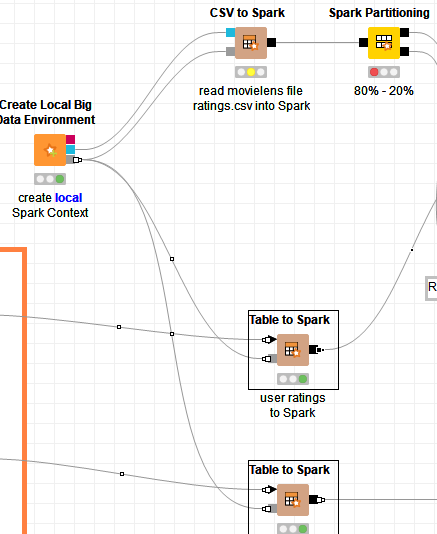
- Setelah selesai dengan rating dari user, sambungkan pada Big Data Environment yang telah dibuat sebelumnya
- Lalu tambahkan node CSV to Spark untuk membaca data ratings.csv dari MovieLens untuk proses testing

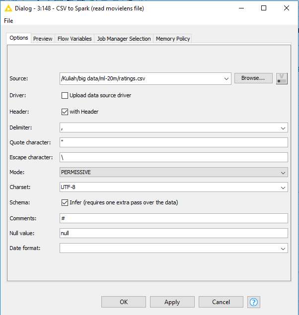
- Konfigurasi pada node CSV to Spark yang berfungsi untuk membaca data ratings.csv

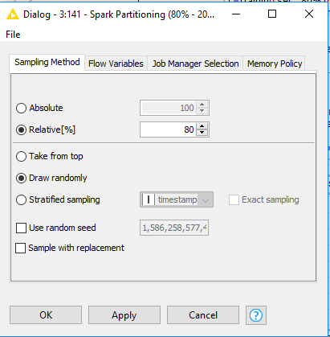
- Konfigurasi node Spark Partitioning yang berfungsi untuk mempartisi data rating.csv menjadi 80% untuk proses Training dan 20% sisanya untuk proses Testing

# Modelling

### 
- 

### 
- 

### 
- 

# Evaluation
- 

# Deployment
- 

### Hasil Deploy CSV

### Hasil Deploy Database

