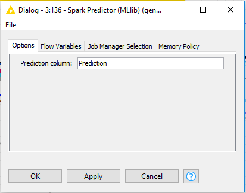

## Big Data Genap 2019/2020

**Nama**  : Ramadhan Ilham Irfany 
**NRP**   : 05111740000121   

# Business Understanding
Kemungkinan proses yang dapat dilakukan pada dataset yang digunakan antara lain :
 1. Pengelompokan film berdasarkan genre yang diinginkan
 
 2. Pengelompokan film berdasarkan rating yang diberikan oleh user dari tahun 1995 sampai 2015
 
 3. Merekomendasikan film dalam jumlah tertentu berdasarkan rating yang diberikan oleh user dari tahun 1995 sampai 2015
 
 
# Data Understanding
- Dataset yang digunakan bersumber dari [MovieLens](http://movielens.org). 

- Dataset yang disajikan memuat rating berbasis 5-bintang berjumlah 20000263 rating, dan 465564 tag dari keseluruhan 27278 film. Data menampung rating dari 138493 user sejak tanggal 9 Januari 1995 sampai 31 Maret 2015. Dataset ini sendiri dibuat pada 17 Oktober 2016.

- Data yang dimuat dalam [MovieLens 20M Dataset](https://grouplens.org/datasets/movielens/) ini terdapat beberaba file CSV, dimana setiap CSV memiliki data atribut dengan rincian sebagai berikut:
    - genome-scores.csv = berisikan data relevansi antara suatu film dan tag nya untuk kepentingan rekomendasi
       - movieId
       - tagId
       - relevance
    - genome-tags.csv = berisikan data pengidentifikasian tag yang diberikan oleh user untuk kepentingan rekomendasi
       - tagId
       - tag
    - links.csv = berisikan data tentang sumber rating (imdb dan tmdb)
       - movieId
       - imdbId
       - tmdbId
    - movies.csv = berisikan daftar film yang tersedia
       - movieId
       - title
       - genres
    - ratings.csv = berisikan data rating yang diberikan oleh user
       - userId
       - movieId
       - rating
       - timestamp
    - tags.csv = berisikan tag yang diberikan oleh user
       - userId
       - movieId
       - tag
       - timestamp

# Data Preparation

- Pertama-tama membuat spark context local menggunakan Create Local Big Data Environment

- Konfigurasi pada node Create Local Big Data Environment

- Lalu membuat profil user dengan ID 999999 untuk memberi rating pada 20 film acak

- Konfigurasi pada node File Reader untuk membaca file movies.csv

- Di dalam node add fields terdapat beberapa komponen
- Node add fields sendiri merupakan penambahan kolom untuk user ID 999999

- Konfigurasi pada node Row Splitter untuk mengambil 20 film

- Di dalam node Ask User for Movie Ratings terdapat beberapa komponen
- Node Ask User for Movie Ratings ini meminta user ID 999999 untuk merating 20 movie yang terpilih

- Konfigurasi untuk memberi rating di dalam komponen Constant Value Column
- Disini saya memberi rating 5 yang menandakan 20 film tersebut sangat disukai oleh user ID 999999 dan akan mencari rekomendasi dari film tersebut

- Film sudah diberikan rating

- Di dalam node no rating terdapat beberapa komponen
- Node no rating sendiri berfungsi untuk membuat list film dengan rating 0

- Kemudian tambahkan node Table to Spark dan pisahkan film dengan rating ke proses testing dan yang tanpa rating ke deployment
- Fungsinya adalah untuk menaruh data table ke dataframe spark

- Setelah selesai dengan rating dari user, sambungkan pada Big Data Environment yang telah dibuat sebelumnya
- Lalu tambahkan node CSV to Spark untuk membaca data ratings.csv dari MovieLens untuk proses testing

- Konfigurasi pada node CSV to Spark yang berfungsi untuk membaca data ratings.csv

- Konfigurasi node Spark Partitioning yang berfungsi untuk mempartisi data rating.csv menjadi 80% untuk proses Training dan 20% sisanya untuk proses Testing

# Modelling

- Data yang digunakan pada proses Training ini berisikan 80% data film dari ratings.csv dan 20 film yang disukai oleh user ID 999999

- Konfigurasi node Spark Collaborative Filtering Learner (MLlib) yang berfungsi untuk training data menggunakan model algoritma ALS

# Evaluation

- Data yang digunakan pada proses Testing ini berisikan 20% data film dari ratings.csv dan 20 film yang disukai oleh user ID 999999

- Konfigurasi node Spark Predictor (MLlib) yang berfungsi untuk memprediksi data data meletakkan pada kolom Prediction

- Hasil dari Spark Predictor untuk Testing

- Konfigurasi node Spark Missing Value untuk menghilangkan NaN

- Konfigurasi node Spark Numeric Scorer yang berfungsi untuk menghitung numerical error dari rating original dan rating prediksi

- Hasil dari kalkulasi

# Deployment

- Proses deployment untuk membuat rekomendasi Top 20 dengan rekomendasi 10 film dari data Training
- Node Spark Predictor (MLlib) terhubung dengan node no rating pada proses Data Preparation

- Konfigurasi node Spark Predictor (MLlib) yang berfungsi untuk memprediksi data data meletakkan pada kolom Prediction

- Hasil dari Spark Predictor untuk Deployment

- Konfigurasi node Spark to Table untuk menaruh data dari dataframe spark ke table 

- Didalam metanode Top 20 recommended movies terdapat sekumpulan node yang berfungsi untuk mengurutkan rekomendasi film berdasarkan rating terbaik dari data Training dan mengekstraknya sebanyak 20 film terbaik

- Di dalam node Display Recommendations terdapat beberapa komponen
- Node Display Recommendations sendiri berfungsi untuk menampilkan hasil rekomendasi pada portal web

- Hasil rekomendasi apabila pada user ID 999999 menilai ke-20 film diawal dengan nilai 5 (apabila semua film kesukaannya)

- Konfigurasi node CSV Writer yang berfungsi untuk memasukkan hasil kedalam file csv

- Hasil berhasil dimasukkan ke dalam file CSV

# Membandingkan berapa lama waktu yang diperlukan File Reader dan CSV to Spark untuk membaca file

- Menggunakan node Time Info yang berfungsi untuk melihat laporan dari semua eksekusi pada workflow

- Dilihat dari perbandingan waktu eksekusi diatas terlihat bahwa CSV to Spark lebih cepat daripada File Reader.
- File yang di read pada percobaan di atas memakai ratings.csv yang memiliki ukuran file yang besar
- Lalu bagaimana jika file yang digunakan adalah file berukuran kecil?

- Mencoba untuk membaca file links.csv yang berukuran kecil
- Dapat dilihat bahwa hasil menampilkan yang sebaliknya
- Kenapa hal itu bisa terjadi?

### Kesimpulan

- CSV to Spark membaca file dengan pemrosesan secara paralel sehingga cocok untuk file ratings.csv yang berukuran besar
- Namun apabila file yang dibaca berukuran kecil seperti links.csv, CSV to Spark akan lebih lama karena proses pemilahan pembacaan data yang memakan cukup banyak waktu

# Keseluruhan workflow KNMIE

