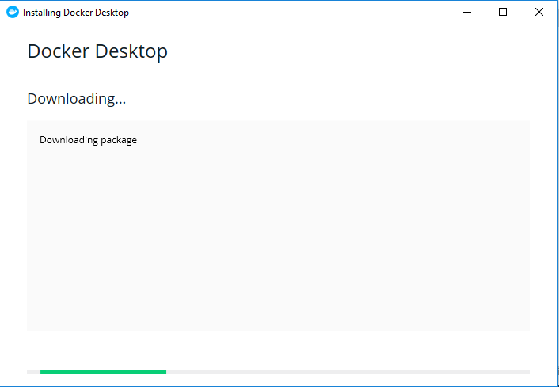
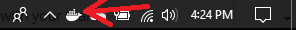

## Big Data Genap 2019/2020

**Nama**  : Ramadhan Ilham Irfany 
**NRP**   : 05111740000121   

# Implementasi Infrastruktur Kafka

## Tahap instalasi

- Install Docker Desktop pada link [berikut](https://docs.docker.com/docker-for-windows/install/)
- Docker Desktop memiliki system requirements seperti berikut:
  - Windows 10 64-bit: Pro, Enterprise, or Education (Build 15063 or later).
  - Hyper-V and Containers Windows features must be enabled.

- Setelah menginstall Docker Desktop, maka ikon tersebut akan muncul pada bagian kanan taskbar
