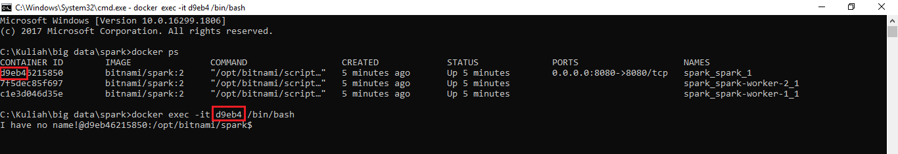

## Big Data Genap 2019/2020

**Nama**  : Ramadhan Ilham Irfany<br>
**NRP**   : 05111740000121<br><br><br>

# Membuat Apache Spark Cluster Menggunakan Docker


## Membuat Apache Spark Cluster
- Pertama membuat script bernama `docker-compose.yml` yang berisi:
```
version: '2'

services:
  spark:
    image: bitnami/spark:2
    environment:
      - SPARK_MODE=master
      - SPARK_RPC_AUTHENTICATION_ENABLED=no
      - SPARK_RPC_ENCRYPTION_ENABLED=no
      - SPARK_LOCAL_STORAGE_ENCRYPTION_ENABLED=no
      - SPARK_SSL_ENABLED=no
    ports:
      - '8080:8080'
  spark-worker-1:
    image: bitnami/spark:2
    environment:
      - SPARK_MODE=worker
      - SPARK_MASTER_URL=spark://spark:7077
      - SPARK_WORKER_MEMORY=1G
      - SPARK_WORKER_CORES=1
      - SPARK_RPC_AUTHENTICATION_ENABLED=no
      - SPARK_RPC_ENCRYPTION_ENABLED=no
      - SPARK_LOCAL_STORAGE_ENCRYPTION_ENABLED=no
      - SPARK_SSL_ENABLED=no
  spark-worker-2:
    image: bitnami/spark:2
    environment:
      - SPARK_MODE=worker
      - SPARK_MASTER_URL=spark://spark:7077
      - SPARK_WORKER_MEMORY=1G
      - SPARK_WORKER_CORES=1
      - SPARK_RPC_AUTHENTICATION_ENABLED=no
      - SPARK_RPC_ENCRYPTION_ENABLED=no
      - SPARK_LOCAL_STORAGE_ENCRYPTION_ENABLED=no
      - SPARK_SSL_ENABLED=no
```
- Script diatas membuat 1 spark master dan 2 spark worker dengan 2 core
- Kemudian jalankan perintah berikut pada command prompt:
```
docker-compose up
```


- Tunggu sampai proses pembuatan selesai


- Setelah itu cek apakah container berhasil dibuat


- Tes spark cluster melalui [http://localhost:8080](http://localhost:8080) dan akan muncul tampilan sebagai berikut


## Menjalankan Script Python di Dalam Apache Spark Cluster
- Perhatikan CONTAINER ID dari spark master kemudian lakukan perintah bash seperti berikut:
```
docker exec -it <container_id> /bin/bash
```


- Cek alamat IP spark master menggunakan
```
hostname -i
```


- Kemudian menggunakan fitur dari Apache Spark yaitu `spark-submit`. dalam tugas ini akan dilakukan penghitungan nilai Pi.
- Jalankan perintah berikut:
```
spark-submit --master spark://172.19.0.4:7077 examples/src/main/python/pi.py 100
```
- 172.19.0.4 diatas adalah alamat IP dari Apache Spark pada port 7077
- Konstanta 100 merupakan partisi dari proses penghitungan Pi yang akan dijalankan
- Cek kembali web [http://localhost:8080](http://localhost:8080) untuk memonitoring proses
- Apabila proses sedang berlangsung akan muncul tampilan seperti berikut:


- Tunggu sampai perintah selesai dijalankan sampai menemukan nilai pi


## Perbandingan
- Dalam tugas ini akan dilakukan perbandingan pada spesifikasi berikut:
    - Jumlah worker: 2, 5
    - Jumlah CPU: 2, 4
    - Memory: 1G
    - Partisi: 100, 1000
- Untuk mengetes dengan 5 worker dan 4 CPU maka docker harus dijalankan kembali dengan menggunakan script `docker-compose.yml` sebagai berikut:
```
version: '2'

services:
  spark:
    image: bitnami/spark:2
    environment:
      - SPARK_MODE=master
      - SPARK_RPC_AUTHENTICATION_ENABLED=no
      - SPARK_RPC_ENCRYPTION_ENABLED=no
      - SPARK_LOCAL_STORAGE_ENCRYPTION_ENABLED=no
      - SPARK_SSL_ENABLED=no
    ports:
      - '8080:8080'
  spark-worker-1:
    image: bitnami/spark:2
    environment:
      - SPARK_MODE=worker
      - SPARK_MASTER_URL=spark://spark:7077
      - SPARK_WORKER_MEMORY=1G
      - SPARK_WORKER_CORES=1
      - SPARK_RPC_AUTHENTICATION_ENABLED=no
      - SPARK_RPC_ENCRYPTION_ENABLED=no
      - SPARK_LOCAL_STORAGE_ENCRYPTION_ENABLED=no
      - SPARK_SSL_ENABLED=no
  spark-worker-2:
    image: bitnami/spark:2
    environment:
      - SPARK_MODE=worker
      - SPARK_MASTER_URL=spark://spark:7077
      - SPARK_WORKER_MEMORY=1G
      - SPARK_WORKER_CORES=1
      - SPARK_RPC_AUTHENTICATION_ENABLED=no
      - SPARK_RPC_ENCRYPTION_ENABLED=no
      - SPARK_LOCAL_STORAGE_ENCRYPTION_ENABLED=no
      - SPARK_SSL_ENABLED=no
  spark-worker-3:
    image: bitnami/spark:2
    environment:
      - SPARK_MODE=worker
      - SPARK_MASTER_URL=spark://spark:7077
      - SPARK_WORKER_MEMORY=1G
      - SPARK_WORKER_CORES=1
      - SPARK_RPC_AUTHENTICATION_ENABLED=no
      - SPARK_RPC_ENCRYPTION_ENABLED=no
      - SPARK_LOCAL_STORAGE_ENCRYPTION_ENABLED=no
      - SPARK_SSL_ENABLED=no
  spark-worker-4:
    image: bitnami/spark:2
    environment:
      - SPARK_MODE=worker
      - SPARK_MASTER_URL=spark://spark:7077
      - SPARK_WORKER_MEMORY=1G
      - SPARK_WORKER_CORES=1
      - SPARK_RPC_AUTHENTICATION_ENABLED=no
      - SPARK_RPC_ENCRYPTION_ENABLED=no
      - SPARK_LOCAL_STORAGE_ENCRYPTION_ENABLED=no
      - SPARK_SSL_ENABLED=no
  spark-worker-5:
    image: bitnami/spark:2
    environment:
      - SPARK_MODE=worker
      - SPARK_MASTER_URL=spark://spark:7077
      - SPARK_WORKER_MEMORY=1G
      - SPARK_WORKER_CORES=0
      - SPARK_RPC_AUTHENTICATION_ENABLED=no
      - SPARK_RPC_ENCRYPTION_ENABLED=no
      - SPARK_LOCAL_STORAGE_ENCRYPTION_ENABLED=no
      - SPARK_SSL_ENABLED=no
```
- Cek terlebih dahulu pada web [http://localhost:8080](http://localhost:8080)


- Berikut hasil perbadingan menggunakan 2 worker dengan 2 CPU antara 100 dan 1000 partisi


- Berikut hasil perbadingan menggunakan 5 worker dengan 4 CPU antara 100 dan 1000 partisi


## Kesimpulan
- Dalam percobaan diatas, pada pemakaian 2 worker dan 2 CPU (core), penggunaan 100 partisi selesai pada 44 detik sedangkan pada penggunaan 1000 partisi selesai pada 3,4 menit atau sama dengan sekitar 3 menit 24 detik. pada proses terdapat overhead proses map-reduce. yang mana waktu lebih banyak terbuang di proses map-reduce (pembagian kerja dan pengumpulan hasil).
- Pada pemakaian 5 dan 4 CPU (core), penggunaan 100 partisi selesai pada 44 detik sedangkan pada penggunaan 1000 partisi selesai pada 2,9 menit atau sama dengan sekitar 2 menit 54 detik.
- Bisa disimpulkan bahwa dengan menambah worker dengan 0 CPU (tanpa CPU) maka worker tersebut tidak akan melakukan proses pencarian pi, dan dengan menambahkan worker/CPU tersebut masih didapati overhead proses map-reduce. Pada perbandingan 100 partisi antara 2 dan 4 core, tidak terlalu terlihat beda yang signifikan dikarenakan job/task yang dikerjakan masih tergolong sedikit, namun dalam pengerjaan menggunakan 1000 partisi dapa dilihat perbedaan antara 2 dan 4 core, dimana 4 core menyelesaikan proses lebih cepat dikarenakan melakukan pembagian kerja pada lebih banyak core yang mengakibatkan job/task lebih sedikit pada masing-masing core.
- Spesifikasi dari prosesor komputer juga berpengaruh pada proses penjalanan task, dapat dilihat dari core dan thread komputer yang digunakan.
