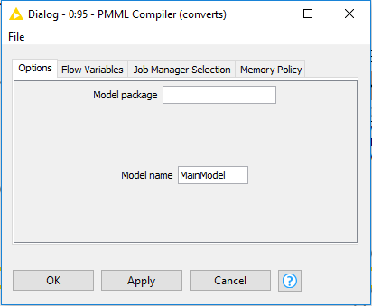
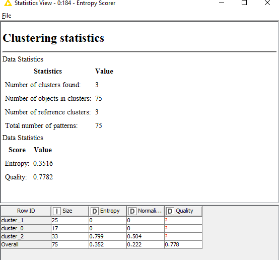
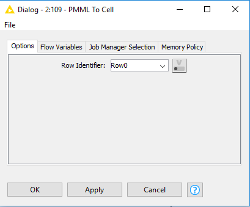

## Big Data Genap 2019/2020

**Nama**  : Ramadhan Ilham Irfany 
**NRP**   : 05111740000121   

List workflow :
- [MLlib model to PMML](https://github.com/rmdhnilham/big-data/tree/master/Tugas6#mllib-model-to-pmml)
- [Spark Compiled Model Predictor](https://github.com/rmdhnilham/big-data/tree/master/Tugas6#spark-compiled-model-predictor)

# MLlib model to PMML

## Business Understanding

Kemungkinan proses yang dapat dilakukan pada dataset yang digunakan antara lain :

1. Mengklasifikasi spesies bunga iris

2. Percobaan untuk data mining

3. Percobaan untuk menggunakan machine learning

## Data Understanding

Data yang digunakan pada proses kali ini adalah [Iris Data Set](https://archive.ics.uci.edu/ml/datasets/Iris) dimana dataset ini  merupakan dataset yang paling terkenal dari Ronald Aylmer Fisher yang sering digunakan dalam literasi seputar pattern recognition. Dataset ini berisi tentang bunga iris yang memiliki 3 class dan 50 jenis pada setiap class dimana 1 class terpisah secara linear dari lainnya.
Adapun atribut yang digunakan meliputi:
- sepal length in cm
- sepal width in cm
- petal length in cm
- petal width in cm
- class:
   - Iris Setosa
   - Iris Versicolour
   - Iris Virginica 

## Data Preparation

- Pertama-tama membuat spark context local menggunakan node **Create Local Big Data Environment**
- Lalu membaca dataset Iris dengan **File Reader**
- Kemudian menambahkan node **Table to Spark** untuk menaruh data table ke dataframe spark
 

- Konfigurasi pada node **Create Local Big Data Environment**
 

- Konfigurasi pada node **File Reader**
 

- Konfigurasi pada node **Table to Spark**
 

## Modelling

- Menambahkan node **Spark k-Means** untuk train model ke dalam spark dengan menggunakan 4 variabel dari bunga Iris pada dataset
- Lalu menambahkan node **Spark MLlib to PMML** untuk mengubah model di dalam spark menjadi PMML
- Kemudian menambahkan node **PMML Compiler** untuk menerjemahkan model PMML ke Java yang nantinya akan dijalankan oleh node **Compiled Model Predictor
 

- Konfigurasi pada node **Spark k-Means**
 

- Konfigurasi pada node **Spark MLlib to PMML**
 

- Konfigurasi pada node **PMML Compiler**
 

## Evaluation

- Untuk evaluasi, pertama-tama membaca dataset Iris dengan menambahkan node **File Reader**
- Lalu menambahkan node **Compiled Model Predictor** untuk membuat prediction
- Kemudian menambahkan node **Entropy Scorer** untuk melakukan penghitungan entropi dari prediction yang telah dibuat
 

- Konfigurasi pada node **File Reader**
 

- Konfigurasi pada node **Compiled Model Predictor**
 

- Konfigurasi pada node **Entropy Scorer**
 

- Hasil dari penghitungan entropy
 

## Deployment

- Untuk deployment, pertama-tama memasukkan inputan JSON variabel bunga Iris yang ingin diklasifikasi dengan menambahkan node **Container Input (JSON)**
- Lalu menambahkan node **JSON to Table** untuk mengubah input JSON menjadi tabel multi kolom
- Kemudian menambahkan node **Compiled Model Predictor** untuk membuat prediction
- Setelah itu menambahkan node **Table to JSON** untuk mengubah kembali tabel multi kolom ke bentuk JSON
- Terakhir, menambahkan node **Container Output (JSON)** untuk memperlihatkan output JSON cluster dari bunga Iris yang dimasukkan pada input
 

- Konfigurasi pada node **Container Input (JSON)**
- Masukkan inputan yaitu 4 variable bunga Iris yang ingin diklasifikasi
 

- Konfigurasi pada node **JSON to Table**
 

- Konfigurasi pada node **Compiled Model Predictor**
 

- Konfigurasi pada node **Table to JSON**
 

- Konfigurasi pada node **Container Output (JSON)**
 

- Hasil output JSON cluster dari spesifikasi variable bunga Iris yang diinputkan diatas
 

## Keseluruhan workflow KNIME

 

# Spark Compiled Model Predictor

## Business Understanding

Kemungkinan proses yang dapat dilakukan pada dataset yang digunakan antara lain :

1. Mengklasifikasi spesies bunga iris

2. Percobaan untuk data mining

3. Percobaan untuk menggunakan machine learning

 
## Data Understanding

Data yang digunakan pada proses kali ini adalah [Iris Data Set](https://archive.ics.uci.edu/ml/datasets/Iris) dimana dataset ini  merupakan dataset yang paling terkenal dari Ronald Aylmer Fisher yang sering digunakan dalam literasi seputar pattern recognition. Dataset ini berisi tentang bunga iris yang memiliki 3 class dan 50 jenis pada setiap class dimana 1 class terpisah secara linear dari lainnya.
Adapun atribut yang digunakan meliputi:
- sepal length in cm
- sepal width in cm
- petal length in cm
- petal width in cm
- class:
   - Iris Setosa
   - Iris Versicolour
   - Iris Virginica 

## Data Preparation

- Pertama-tama membaca dataset Iris dengan **File Reader**
- Lalu menambahkan node **Decision Tree Learner** untuk membuat decision tree
- Kemudian  menambahkan node **RProp MLP Learner** untuk membuat RProp trained neural network
- Setelah itu menyambungkan kedua node learner tersebut dengan node **PMML to Cell** untuk mengubah PMML port menjadi tabel yang berisi PMML cell
 

- Konfigurasi pada node **File Reader**
 

- Konfigurasi pada node **Decision Tree Learner**
 

- Konfigurasi pada node **RProp MLP Learner**
 

- Konfigurasi pada node **PMML to Cell**
 

## Modelling

- Dari kedua node **PMML to Cell** dihubungkan kepada node **Concatenate**
- Lalu Menambahkan node **Table to PMML Ensemble** untuk menggabungkan tabel PMML menjadi satu dokumen pmml dengan model mining
- Kemudian menambahkan node **PMML Compiler** untuk menerjemahkan model PMML ke Java yang nantinya akan dijalankan oleh node **Spark Compiled Model Predictor
 

- Konfigurasi pada node **Concatenate**
 

- Konfigurasi pada node **Table to PMML Ensemble**
 

- Konfigurasi pada node **PMML Compiler**
 

## Evaluation

- Untuk evaluasi, pertama-tama membaca dataset Iris dengan menambahkan node **File Reader**
- Kemudian membuat spark context local menggunakan node **Create Local Big Data Environment**
- Setelah membuat spark context local lalu menambahkan node **Table to Spark** untuk menaruh data table ke dataframe spark
- Lalu menambahkan node **Spark Compiled Model Predictor** untuk membuat prediction
- Setelah itu menambahkan node **Spark to Table** untuk menaruh data dari dataframe spark ke table
- Kemudian menambahkan node **Scorer** untuk melakukan penghitungan confusion matrix dari prediction yang telah dibuat
 

- Konfigurasi pada node **File Reader**
 

- Konfigurasi pada node **Create Local Big Data Environment**
 

- Konfigurasi pada node **Table to Spark**
 

- Konfigurasi pada node **Spark Compiled Model Predictor**
 

- Konfigurasi pada node **Spark to Table**
 

- Konfigurasi pada node **Scorer**
 

- Hasil confusion matrix
 

## Deployment

- Karena pada workflow orisinil tidak terdapat proses deployment, maka untuk deployment saya akan mendeploy confusion matrix ke dalam sebuah file berformat (.csv) dengan menambahkan node **CSV Writer**
 

- Konfigurasi pada node **CSV Writer**
 

- Hasil dari scorer yang telah dideploy menjadi file (.csv)

## Keseluruhan workflow KNIME

