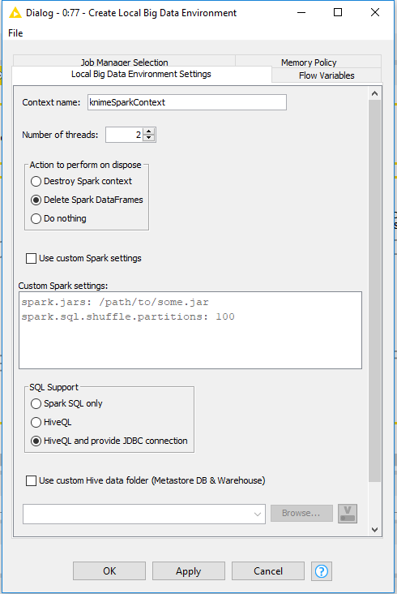
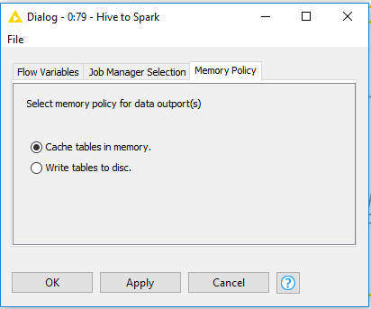
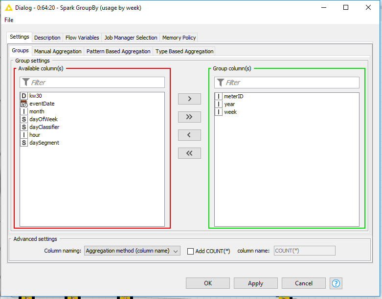
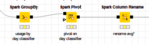
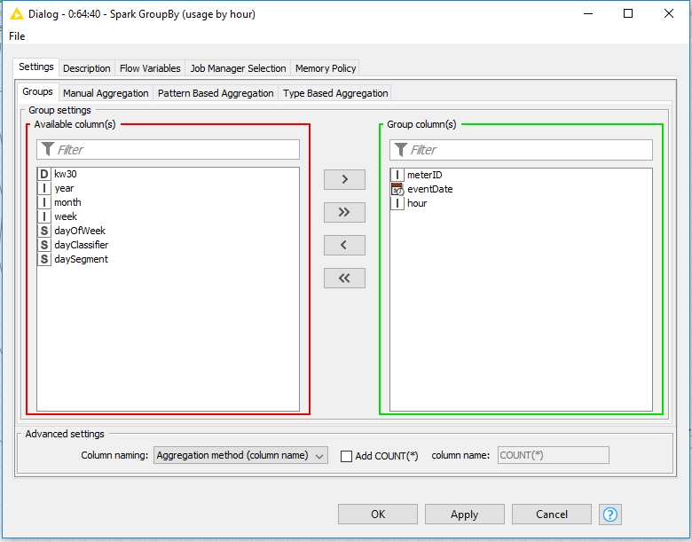
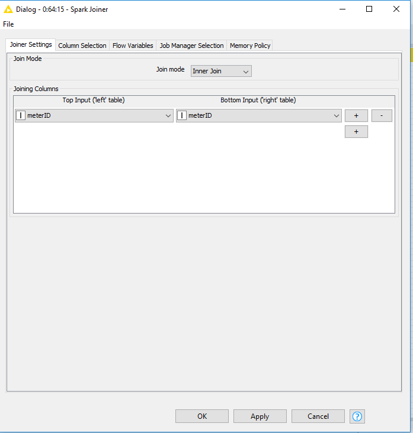
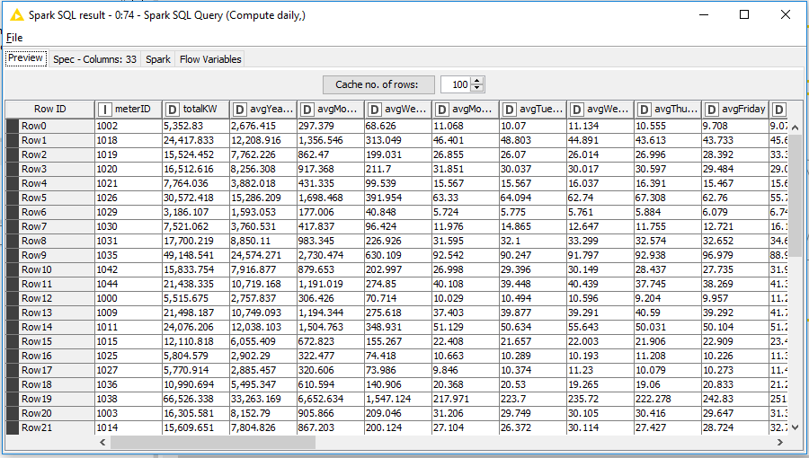

## Big Data Genap 2019/2020

**Nama**  : Ramadhan Ilham Irfany<br>
**NRP**   : 05111740000121<br><br><br>

# Analisis Kebutuhan Listrik di Irlandia

## Business Understanding
Proses yang dilakukan pada dataset yang digunakan adalah :
- Menganalisis rata-rata kebutuhan penggunaan listrik di Irlandia pada kurun waktu tertentu (time series), dengan mempertimbangkan berbagai variabel, yaitu:
   - **Total Usage**: Keseluruhan Penggunaan Listrik.
   - **Usage by Year**: Penggunaan Listrik per Tahun.
   - **Usage by Month**: Penggunaan Listrik per Bulan.
   - **Usage by Week**: Penggunaan Listrik per Minggu.
   - **Usage by Day of Week**: Penggunaan Listrik per Hari dalam Seminggu.
   - **Usage by Day**: Penggunaan Listrik per Hari.
   - **Usage by Day Segment**: Penggunaan Listrik per Hari pada Periode Jam Tertentu.
   - **Usage by Day Classifier**: Penggunaan Listrik pada Pengelompokan Weekend dan Weekday.
   - **Usage by Hour**: Penggunaan Listrik pada Jam Tertentu.


## Data Understanding
Data yang digunakan pada proses kali ini adalah Data Penggunaan Listrik di Irlandia dengan atribut yang digunakan meliputi:
- **meterID**: ID dari meteran listrik.
- **enc_datetime**: Tanggal yang telah dienkripsi.
- **reading**: Nilai meter yang terbaca pada meteran listrik.
 

## Data Preparation

- Pertama-tama membuat spark context local menggunakan node **Create Local Big Data Environment**
- Lalu membaca dataset Penggunaan Listrik di Irlandia dengan **File Reader**

- Berikut konfigurasi node **Create Local Big Data Environment**


- Dan berikut untuk konfigurasi node **File Reader**


- Setelah itu menambahkan metanode **Load Data** yang berisikan node-node sebagai berikut


- Pada node **DB Table Creator**, masukkan konfigurasi seperti berikut, dimana menamai tabel sebagai "meter"


- Untuk konfigurasi node **DB Loader** adalah seperti berikut<br>


- Setelah itu data sudah masuk pada DB dan siap untuk diproses lebih jauh


- Untuk optional dapat di cek pada DBeaver apakah DB sudah masuk pada Hive atau belum, pertama dengan mengecek port pada node **Create Local Big Data Environment**


- Setelah itu masuk ke DBeaver dan membuka Apache Hive dengan URL
```
jdbc:hive2://localhost:56063/
```
- Kemudian lakukan query untuk melihat data pada tabel meter yang sudah dibuat diatas


## Modelling

- Setelah Data berhasil di load, kemundian ubah menjadi data Spark dengan node **Hive to Spark** dengan konfigurasi sebagai berikut<br>


- Pada model ini terdapat 2 metanode yaitu:
	1. **Extract date-time attributes**: untuk mendapatkan waktu agar dapat di proses untuk selanjutnya
	2. **Agreagations and time series**: agregasi penggunaan listrik pada 9 kategori pada **Bussiness Understanding**
	
### 1. Extract date-time attributes
- Untuk metanode Extract date-time attributes bersikan oleh 4 node **Spark SQL Query** sebagai berikut


- Untuk node **Spark SQL Query** pertama yaitu untuk mengkonversikan datetime


- Berikut SQL Query yang ada pada node tersebut
```
SELECT 

meterid,
enc_datetime,
reading as kw30,
date_add(cast('2008-12-31' as timestamp), cast(substr(enc_datetime, 1, 3) as int)) as eventDate,
concat(
	substr(concat("00", cast(cast((cast(substr(enc_datetime, 4) as int) * 30 / 60) as int) %24 as string)), -2, 2),":", 
	substr(concat("00", cast(cast(cast(substr(enc_datetime, 4) as int) * 30 % 60 as int) as string)), -2, 2)
) as my_time

FROM #table# t1
```
Dimana SQL tersebut akan membuat kolom eventDate yang diambil dari enc_datetime dan my_time yang memiliki format jj:mm

- Berikut hasil dari query tersebut


- Untuk node **Spark SQL Query** kedua yaitu untuk mengekstrak eventDate menjadi jam, hari, minggu, bulan, tahun seperti 9 kategori pada **Bussiness Understanding**


- Berikut SQL Query yang ada pada node tersebut
```
SELECT 

meterid,
kw30,
eventDate,
year(eventDate) as year,
month(eventDate) as month,
weekofyear(eventDate) as week,
date_format(eventDate, 'EEEE') as dayOfWeek,
hour(my_time) as hour

FROM #table# t1
```

- Berikut hasil dari query tersebut


- Untuk node **Spark SQL Query** ketiga yaitu untuk mengelompokkan Weekend dan Weekday


- Berikut SQL Query yang ada pada node tersebut
```
SELECT *, 
CASE 
WHEN dayOfWeek in ('Saturday','Sunday') 	THEN 'WE' 
						ELSE 'BD' 
END as dayClassifier

from #table#
```

- Berikut hasil dari query tersebut


- Untuk node **Spark SQL Query** terakhir pada metanode ini yaitu untuk membuat segmentasi periode jam pada satu hari


- Berikut SQL Query yang ada pada node tersebut
```
SELECT meterID, kw30, eventDate, year, month, week, dayOfWeek, dayClassifier, hour,
CASE 
WHEN hour >=7 AND hour <9 THEN '7-9'
WHEN hour >=9 AND hour <13 THEN '9-13' 
WHEN hour >=13 AND hour <17 THEN '13-17' 
WHEN hour >=17 AND hour <21 THEN '17-21' 
WHEN hour >=21 OR hour <7 THEN '21-7'  
								 
END as daySegment

from #table#
```

- Berikut hasil dari query tersebut


### 2. Agreagations and time series

- Metanode ini adalah untuk membuat time-series berdasarkan 9 kategori pada **Business Understanding** yaitu:
   - **Total Usage**: Keseluruhan Penggunaan Listrik.
   - **Usage by Year**: Penggunaan Listrik per Tahun.
   - **Usage by Month**: Penggunaan Listrik per Bulan.
   - **Usage by Week**: Penggunaan Listrik per Minggu.
   - **Usage by Day of Week**: Penggunaan Listrik per Hari dalam Seminggu.
   - **Usage by Day**: Penggunaan Listrik per Hari.
   - **Usage by Day Segment**: Penggunaan Listrik per Hari pada Periode Jam Tertentu.
   - **Usage by Day Classifier**: Penggunaan Listrik pada Pengelompokan Weekend dan Weekday.
   - **Usage by Hour**: Penggunaan Listrik pada Jam Tertentu.
- Gambaran prosesnya adalah:
	- Pengambilan jumlah penggunaan listrik dengan menggunakan agregasi SUM untuk tiap kategori
	- Lalu pada kategori selain **Total Usage** diambil rata-rata penggunaan listrik tiap kategori menggunakan agregasi AVG
	- Sebagai catatan pada kategori **Usage by Day of Week**, **Usage by Day Segment**, dan **Usage by Day Classifier** perlu dibuatkan pivot untuk mengelompokkan kolom tiap-tiap kluster
	- Setelah itu semua kategori diganti nama agar mudah untuk dibaca dan digabungkan menggunakan Joiner 
- Sebelum memproses data tambahkan node **Persist Spark DataFream/RDD** dengan konfigurasi sebagai berikut


- Berikut ini adalah dokumentasi untuk tiap-tiap kategori:
#### Total Usage

- Konfigurasi node **Spark GroupBy** untuk pengambilan jumlah penggunaan listrik dengan menggunakan agregasi SUM pada kategori **Total Usage**


- Konfigurasi node **Spark Column Rename** untuk penggantian nama kolom menjadi **totalKW** agar mudah untuk dibaca


#### Usage by Year

- Konfigurasi node **Spark GroupBy** untuk pengambilan jumlah penggunaan listrik dengan menggunakan agregasi SUM pada kategori **Usage by Year**


- Konfigurasi node **Spark GroupBy** untuk pengambilan rata-rata penggunaan listrik pada kategori **Usage by Year** menggunakan agregasi AVG


- Konfigurasi node **Spark Column Rename** untuk penggantian nama kolom menjadi **avgYearlyKW** agar mudah untuk dibaca


#### Usage by Month

- Konfigurasi node **Spark GroupBy** untuk pengambilan jumlah penggunaan listrik dengan menggunakan agregasi SUM pada kategori **Usage by Month**


- Konfigurasi node **Spark GroupBy** untuk pengambilan rata-rata penggunaan listrik pada kategori **Usage by Month** menggunakan agregasi AVG


- Konfigurasi node **Spark Column Rename** untuk penggantian nama kolom menjadi **avgMonthlyKW** agar mudah untuk dibaca<br>


#### Usage by Week

- Konfigurasi node **Spark GroupBy** untuk pengambilan jumlah penggunaan listrik dengan menggunakan agregasi SUM pada kategori **Usage by Week**


- Konfigurasi node **Spark GroupBy** untuk pengambilan rata-rata penggunaan listrik pada kategori **Usage by Week** menggunakan agregasi AVG


- Konfigurasi node **Spark Column Rename** untuk penggantian nama kolom menjadi **avgWeeklyKW** agar mudah untuk dibaca


#### Usage by Day of Week

- Konfigurasi node **Spark GroupBy** untuk pengambilan jumlah penggunaan listrik dengan menggunakan agregasi SUM pada kategori **Usage by Day of Week**


- Konfigurasi node **Spark GroupBy** untuk pengambilan rata-rata penggunaan listrik pada kategori **Usage by Day of Week** menggunakan agregasi AVG dan juga mengelompokkan hari pada kolom baru


- Konfigurasi node **Spark Column Rename** untuk penggantian nama kolom menjadi **avg(Nama hari)** agar mudah untuk dibaca


#### Usage by Day

- Konfigurasi node **Spark GroupBy** untuk pengambilan jumlah penggunaan listrik dengan menggunakan agregasi SUM pada kategori **Usage by Day**


- Konfigurasi node **Spark GroupBy** untuk pengambilan rata-rata penggunaan listrik pada kategori **Usage by Day** menggunakan agregasi AVG


- Konfigurasi node **Spark Column Rename** untuk penggantian nama kolom menjadi **avgDaily** agar mudah untuk dibaca


#### Usage by Day Segment

- Konfigurasi node **Spark GroupBy** untuk pengambilan jumlah penggunaan listrik dengan menggunakan agregasi SUM pada kategori **Usage by Day Segment**


- Konfigurasi node **Spark GroupBy** untuk pengambilan rata-rata penggunaan listrik pada kategori **Usage by Day Segment** menggunakan agregasi AVG dan juga mengelompokkan periode jam dalam satu hari pada kolom baru


- Konfigurasi node **Spark Column Rename** untuk penggantian nama kolom menjadi **avg_(segmentasi)** agar mudah untuk dibaca<br>


#### Usage by Day Classifier

- Konfigurasi node **Spark GroupBy** untuk pengambilan jumlah penggunaan listrik dengan menggunakan agregasi SUM pada kategori **Usage by Day Classifier**


- Konfigurasi node **Spark GroupBy** untuk pengambilan rata-rata penggunaan listrik pada kategori **Usage by Day Classifier** menggunakan agregasi AVG dan juga mengelompokkan periode jenis hari Weekend atau Weekday pada kolom baru


- Konfigurasi node **Spark Column Rename** untuk penggantian nama kolom menjadi **avg_(klasifikasi)** agar mudah untuk dibaca<br>


#### Usage by Hour

- Konfigurasi node **Spark GroupBy** untuk pengambilan jumlah penggunaan listrik dengan menggunakan agregasi SUM pada kategori **Usage by Hour**


- Konfigurasi node **Spark GroupBy** untuk pengambilan rata-rata penggunaan listrik pada kategori **Usage by Hour** menggunakan agregasi AVG


- Konfigurasi node **Spark Column Rename** untuk penggantian nama kolom menjadi **avg_Hourly** agar mudah untuk dibaca


- Setelah tiap kategori selesai diproses makan join kan semuanya menggunakan node **Spark Joiner**


- Berikut konfigurasi node **Spark Joiner** menggunakan parameter "meterID"



## Evaluation

- Menambahkan node **Spark SQL Query**
- Pada node ini diproses query untuk membuat dan menambahkan kolom reta-rata berisi pesentase penggunaan pada hari di tiap minggu tertentu dan juga periode jam pada hari tertentu


- Berikut SQL Query yang ada pada node tersebut
```
SELECT `meterID`, `totalKW`, `avgYearlyKW`,`avgMonthlyKW`,`avgWeeklyKW`,
       `avgMonday`,`avgTuesday`,`avgWednesday`,`avgThursday`,`avgFriday`,`avgSaturday`,`avgSunday`,
       `avgDaily`,`avg_7to9`,`avg_9to13`,`avg_13to17`,`avg_17to21`,`avg_21to7`,`avg_BD`,`avg_WE`,`avgHourly`,
       (avgMonday / avgWeeklyKW) * 100.0 as pctMonday,
       (avgTuesday / avgWeeklyKW) * 100.0 as pctTuesday,
       (avgWednesday / avgWeeklyKW) * 100.0 as pctWednesday,
       (avgThursday / avgWeeklyKW) * 100.0 as pctThursday,
       (avgFriday / avgWeeklyKW) * 100.0 as pctFriday,
       (avgSaturday / avgWeeklyKW) * 100.0 as pctSaturday,
       (avgSunday / avgWeeklyKW) * 100.0 as pctSunday,
       (avg_7to9 / avgDaily) * 100.0 as pct_7to9,
       (avg_9to13 / avgDaily) * 100.0 as pct_9to13,
       (avg_13to17 / avgDaily) * 100.0 as pct_13to17,
       (avg_17to21 / avgDaily) * 100.0 as pct_17to21,
       (avg_21to7 / avgDaily) * 100.0 as pct_21to7
       
FROM #table#
```

- Berikut hasil dari keseluruhan kolom yang siap untuk di plootting pada tabel


- Setelah itu menambahkan komponen **PCA, K-means, Scatter Plot** untuk menganalisis menggunakan PCA dan K-means kemudian di plot pada tabel menggunakan Scatter Plot
- Berikut isi dari komponen **PCA, K-means, Scatter Plot**


- Pertama-tama melakukan normalisasi menggunakan node **Spark Normalizer** 


- Kemundian melakukan PCA pada 96% data yang digunakan


- Beginilah hasil dari PCA


- Lalu untuk pengelompokan cluster mengunakan algoritma K-means


- Dan beginilah hasil dari pengelompokan K-means


- Tambahkan column filter untuk menyimpan cluster


- Beginilah hasilnya


- Setelah itu tambahkan joiner seperti tahap **Agreagations and time series** dengan parameter "meterID" dan beginilah hasilnya<br>


- Kemudian tambahkan node **Spark to Table** untuk mengubah data spark menjadi table
- Setelah itu lakukan denormalisasi, dan beginilah hasilnya


- Lalu tambahkan node **Number to String** untuk keperluan kustomisasi tabel dengan konfigurasi sebagai berikut


- Beginilah hasil input untuk kustomisasi tabel


- Kemudian tambahkan tahapan untuk membuat tabel<br>


- Berikut konfigurasi dari node **Color Manager**


- Berikut konfigurasi dari node **Table View**


- Berikut konfigurasi dari node **Scatter Plot**


- Kemudian pada denormalisasi ubahlah menjadi spark kembali menjadi **Table to Spark**
- Lalu berilah nama menjadi **PCA_dimension_(nomor_dimensi)** menggunakan node **Spark Column Rename**


## Deployment

- Pada proses deployment di workflow ini terdapat 2 deployment yaitu menggunakan node **Spark to Hive** dan **Spark to Parquet**
- Berikut konfigurasi pada node **Spark to Hive**<br>


- Dan berikut hasil dari deployment


- Untuk opsional dapat dilihat pada Hive menggunakan DBeaver


- Berikut konfigurasi pada node **Spark to Parquet**


- Dan berikut hasil deploymentnya<br>


## Keseluruhan workflow KNIME


